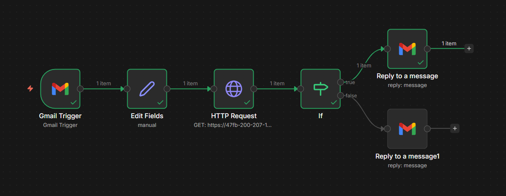

# 📬 Fiscal Search — Automated Email Agent with RAG + n8n

> An end-to-end intelligent email automation pipeline that answers fiscal and exchange-rate queries using a Retrieval-Augmented Generation (RAG) API — fully orchestrated by n8n.




---

## 🧠 What This Does

This project demonstrates an **autonomous fiscal support agent** that:

1. **Monitors a Gmail inbox** for emails with subject `Consulta Fiscal`
2. **Extracts** the question and target country from the email
3. **Queries a RAG API** backed by U.S. Treasury exchange-rate data and Google Gemini
4. **Evaluates confidence** — if the AI is confident (≥ 0.7), it replies automatically; otherwise it flags for human review

This is a real-world pattern for **AI-assisted triage** in compliance, legal, and fiscal support workflows.

---

## 🏗️ Architecture

```
[Gmail Inbox]
     │
     ▼ (subject: "Consulta Fiscal")
[n8n: Gmail Trigger]
     │
     ▼
[n8n: Edit Fields]          ← Extracts: question, country, session_id
     │
     ▼
[n8n: HTTP Request]         ← GET /fiscal_search?question=&country=&session_id=
     │
     ▼
[n8n: If — Confidence ≥ 0.7 AND no error]
     │
     ├── TRUE  ──▶ [Gmail: Reply with technical_analysis]
     │
     └── FALSE ──▶ [Gmail: Reply with "Human intervention required"]
```

### RAG API (Python Backend)

| Component    | Technology                                      |
| ------------ | ----------------------------------------------- |
| LLM          | Google Gemini                                   |
| Embeddings   | `all-MiniLM-L6-v2` via `sentence-transformers`  |
| Vector Store | ChromaDB                                        |
| Data Source  | U.S. Treasury Exchange Rate Records             |
| Framework    | FastAPI + Pydantic                              |
| Memory       | In-memory session history per `session_id`      |
| Audit        | File-based logging (`logs/ai_search_audit.log`) |

---

## 📧 Email Protocol

To trigger the agent, send an email with:

- **Subject format:** `Consulta Fiscal - <Country>`  
  _Example: `Consulta Fiscal - Argentina`_
- **Body:** Your fiscal or exchange-rate question in natural language  
  _Example: `Qual é a moeda oficial?`_

The country is parsed from the subject automatically. If absent, it defaults to `Brazil`.

---

## 🔁 n8n Workflow Breakdown

| Node                  | Type        | Purpose                                                          |
| --------------------- | ----------- | ---------------------------------------------------------------- |
| `Gmail Trigger`       | Trigger     | Polls every minute for unread emails matching subject filter     |
| `Edit Fields`         | Set         | Maps `snippet → pergunta`, `Subject → pais`, `From → session_id` |
| `HTTP Request`        | HTTP        | Calls RAG API with `GET /fiscal_search`                          |
| `If`                  | Conditional | Routes based on `confidence ≥ 0.7` AND no `error_code`           |
| `Reply to a message`  | Gmail       | Sends AI-generated `technical_analysis` back to sender           |
| `Reply to a message1` | Gmail       | Sends human-intervention flag when confidence is insufficient    |

### API Response Schema (`FiscalResponse`)

```json
{
  "result": {
    "technical_analysis": "The official currency of Argentina is Peso.",
    "confidence": 0.91,
    "error_code": "",
    "sources": ["treasury_2024_q1.csv"]
  }
}
```

---

## 🚀 Getting Started

### 1. Clone and configure the RAG API

```bash
git clone https://github.com/<your-user>/fiscal-search-api
cd fiscal-search-api
poetry install
```

Set your environment variable:

```bash
export GEMINI_API_KEY=your_google_gemini_key
```

Run the API:

```bash
poetry run uvicorn main:app --reload
```

> On first run, the `all-MiniLM-L6-v2` embedding model (~80 MB) is downloaded automatically.

### 2. Expose locally with ngrok (for n8n testing)

```bash
ngrok http 8000
```

Copy the generated URL (e.g. `https://47fb-xxx.ngrok-free.app`) and update the `HTTP Request` node in n8n.

### 3. Import the n8n Workflow

1. Open your n8n instance
2. Go to **Workflows → Import from File**
3. Upload `workflow-n8n-triagem-fiscal.json`
4. Connect your Gmail OAuth2 credentials
5. Update the `HTTP Request` URL with your API endpoint
6. **Activate** the workflow

---

## 🔐 Security Considerations

- Gmail OAuth2 credentials are managed securely inside n8n's credential store — they never appear in the workflow JSON
- The RAG API endpoint (ngrok or otherwise) should be protected in production (e.g. API key header, VPN, or private networking)
- Audit logs capture all requests for traceability (`logs/ai_search_audit.log`)

---

## 🧩 Design Patterns Demonstrated

| Pattern                                  | Where                                |
| ---------------------------------------- | ------------------------------------ |
| **RAG (Retrieval-Augmented Generation)** | Python API                           |
| **Confidence-gated automation**          | n8n If node                          |
| **Human-in-the-loop fallback**           | n8n Reply node (false branch)        |
| **Session memory**                       | API `session_id` parameter           |
| **Intent guardrails**                    | Off-topic rejection before retrieval |
| **Structured output with validation**    | Pydantic `FiscalResponse` model      |
| **Event-driven orchestration**           | n8n Gmail Trigger                    |

---

## 📂 Repository Structure

```
.
├── workflow-n8n-triagem-fiscal.json   # n8n workflow (importable)
├── main.py                            # FastAPI RAG application
├── pyproject.toml                     # Poetry dependency manifest
├── logs/
│   └── ai_search_audit.log            # Audit trail
└── README.md
```

---

## 👤 Author

**Pablo Felipe**  
Principal Engineer · Fiscal Compliance & AI Systems  
[LinkedIn](https://www.linkedin.com/in/pablofelipe/) · [GitHub](https://github.com/pablofelipe)

> _This project is part of a hands-on AI learning journey focused on building domain-specific agents for fiscal and regulatory automation._

---

## 📄 License

MIT — free to use, adapt, and build on.
